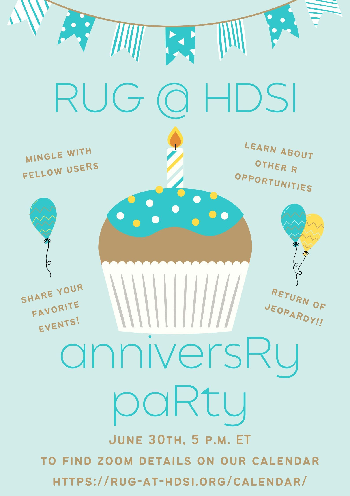
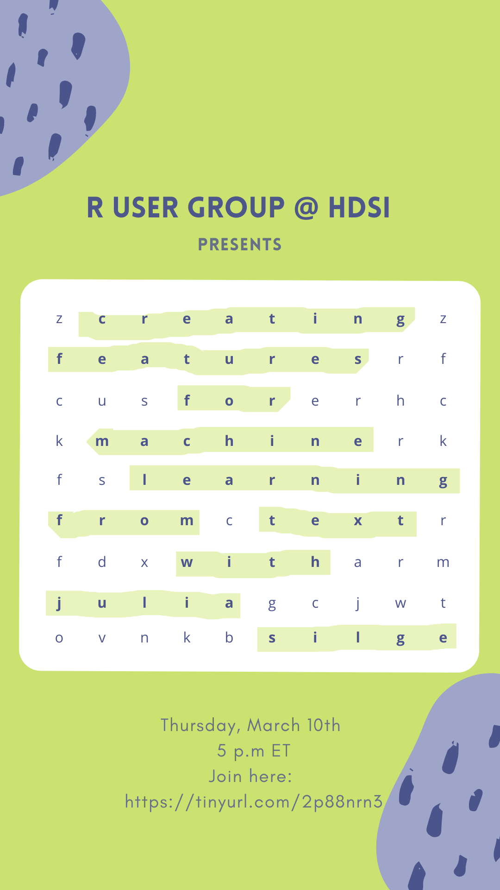
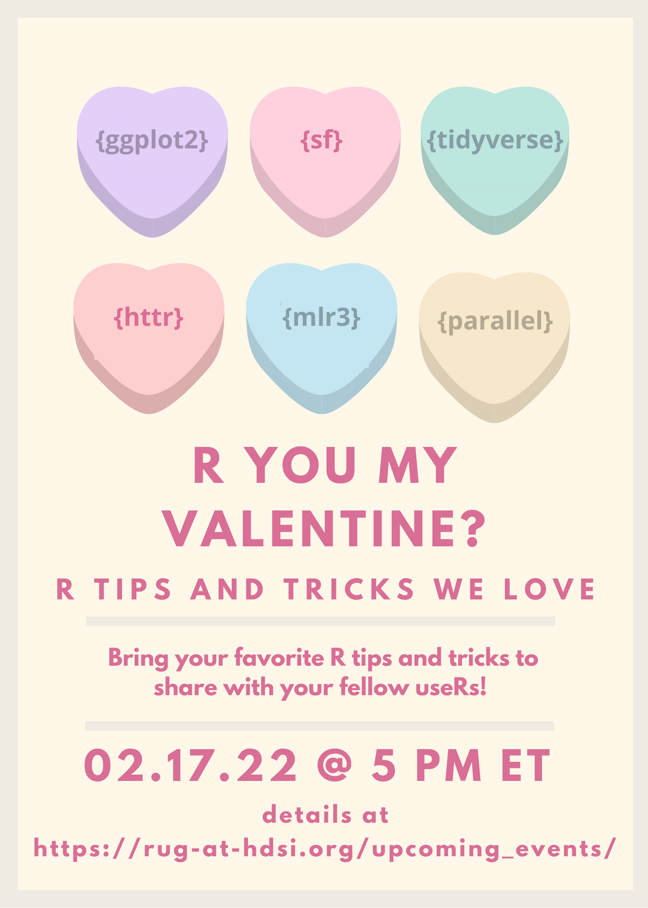
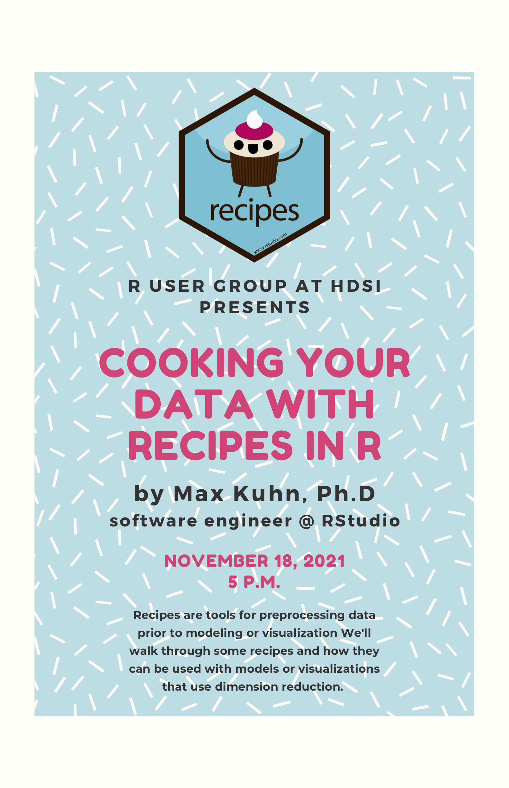
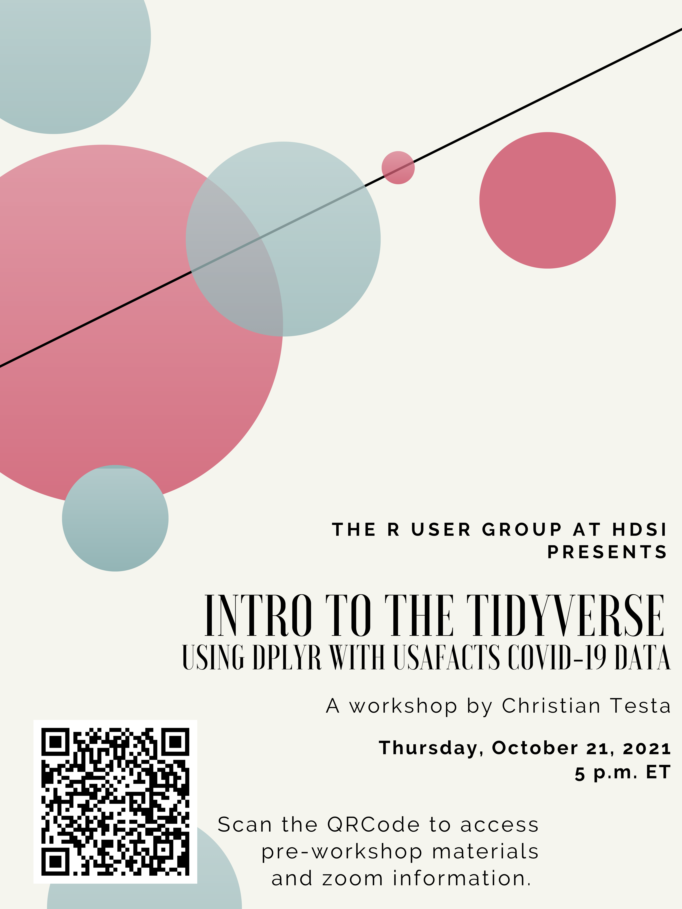
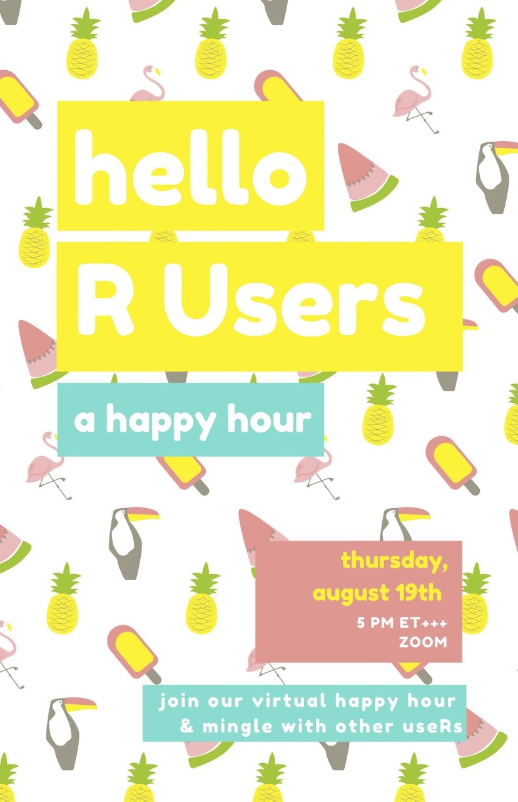
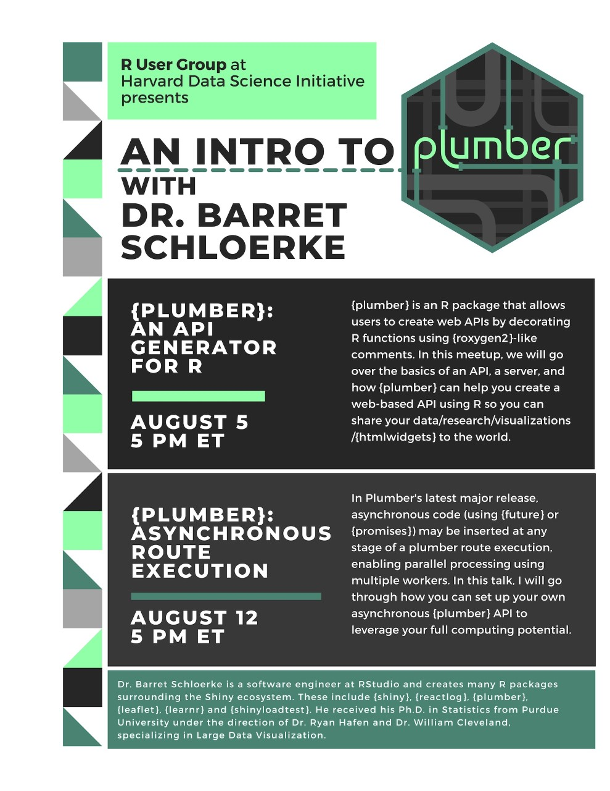
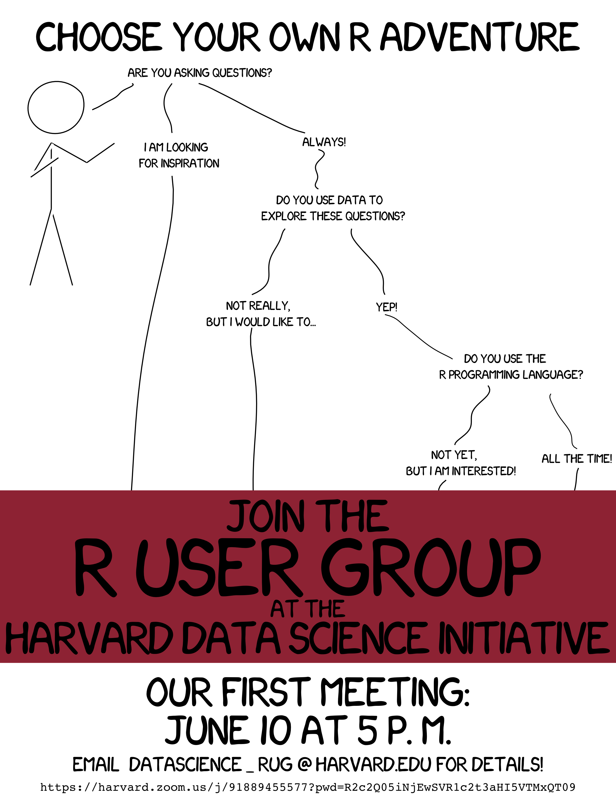

# Meeting Materials for the RUG at HDSI

This repository contains the public materials for presentations given at 
the R User Group at the Harvard Data Science Initiative.

Along with slidedecks and code samples, the repository here also contains the 
posters from our events

  

  

  

